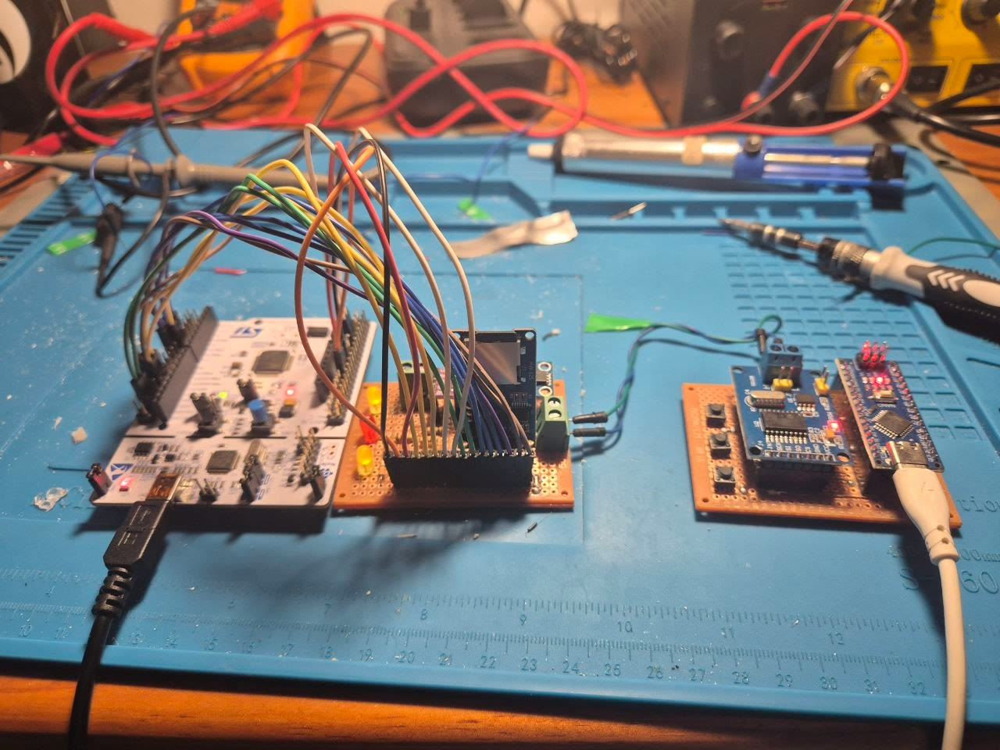

# Aurora BCM

Um compilado de estudos dos principais protocolos da indústria de embarcados e
dos conceitos fundamentais que os sustentam: **UART, I2C, SPI, CAN**, máquinas
de estado, buffer circular, watchdog, tratamento de falha, gravação em flash e,
como ponto final, um **bootloader**.

O que segura tudo junto é um produto: um módulo de carroceria automotivo (*body
control module*) escrito do zero para um **STM32F446RE**, sem HAL e sem código
gerado, só registradores, linker script e libopencm3 como camada fina.

O produto não é decoração. Estudar um protocolo isolado ensina a chamar a função;
estudá-lo dentro de um sistema que já tem outras seis coisas rodando ensina o que
ele custa. É a diferença entre saber configurar o SPI e descobrir que abandonar
uma leitura no meio deixa o cartão travado até perder a alimentação.

A especificação completa, 10 funções, 5 restrições e as etapas, está em
**[DIRETRIZES.md](DIRETRIZES.md)**.



À esquerda a **NUCLEO-F446RE**, o módulo. No meio, a perfboard do BCM: cartão SD
por SPI, as duas setas e o farol de trabalho. À direita, o **veículo simulado**,
um Arduino Nano com MCP2515 e três botões, fazendo o papel do painel.

Os dois fios verdes entre as placas são o **barramento CAN**. É por eles que
apertar um botão da direita acende uma seta da esquerda, e é o único caminho
entre os dois lados: nenhum sinal atravessa por fora do barramento.

## O que foi estudado, e onde mora

| Protocolo / conceito | Onde está | O que o projeto mostra |
|---|---|---|
| **UART** | `hal/uart`, `logic/ring_buffer` | RX e TX por interrupção, buffer circular escrito à mão, parser byte a byte |
| **I2C** | `hal/i2c`, `hal/lm75` | mestre com timeout próprio, tratamento de NACK, recuperação de barramento travado |
| **SPI** | `hal/spi`, `hal/sd_card` | cartão SD do `CMD0` ao sistema de arquivos, negociação de clock |
| **CAN** | `hal/can`, `logic/vehicle_bus` | bxCAN a 500 kbit/s, filtros, dois nós reais conversando |
| **PWM** | `hal/lamps` | TIM2 com rampa de 400 ms sem bloquear nada |
| **ADC** | `hal/adc`, `logic/shunt_current` | medição de corrente por shunt e de tensão de alimentação |
| **Flash** | `hal/config_storage`, `logic/config` | configuração gravada em setor próprio, validada por assinatura |
| **Máquina de estados** | `logic/turn_signal`, `logic/service_light` | várias coisas rodando ao mesmo tempo, nenhuma atrasando as outras |
| **Watchdog e falha** | `hal/watchdog`, `hal/fault_handler` | IWDG, `HardFault`, sete causas de reset distinguidas |
| **Diagnóstico** | `logic/fault_table`, `app/diagnostics` | tabela de falhas com histórico, do jeito que um técnico lê |
| **Sistema de arquivos** | `app/lib/ff16` | FatFs sobre o cartão, gravando log em arquivo |
| **Bootloader** | `bootloader/`, linker próprio | dois programas no mesmo chip: o setor 0 dá a partida na aplicação em 0x08004000, via VTOR, stack pointer e salto |

## A restrição que define a arquitetura

> **R4**: Nenhuma função pode atrasar outra. A seta não pode hesitar porque a
> rampa do farol está rodando. Nada de espera bloqueante.

Isso proíbe `delay` em qualquer lugar do firmware, e é o motivo de tudo aqui ser
máquina de estados alimentada por uma base de tempo comum. Não é preferência de
estilo, e sim consequência direta de um requisito.

O cliente é fictício: **Aurora Implementos**, uma encarroçadora que precisa de um
módulo próprio para tudo que ela acrescenta ao chassi. O problema, esse, é real:
encarroçadoras desenvolvem módulos assim, e é um nicho onde firmware embarcado é
contratado no Brasil. O cliente existe para os requisitos terem dente, é ele que
proíbe o `delay`, não o gosto do autor.

## Progresso

O projeto está **encerrado e completo dentro do seu escopo**. As etapas 12 e 13 do
plano original, integração contínua e PCB própria, ficaram fora do escopo desta versão; o
[DIRETRIZES.md](DIRETRIZES.md) preserva o plano completo como foi concebido.

| # | Etapa | Funções | Status |
|---|---|---|:---:|
| 01 | Uma seta que pisca | - | ✅ |
| 02 | Piscar na frequência certa | `F1` | ✅ |
| 03 | Alavanca de seta e pisca-alerta | `F2` `R4` | ✅ |
| 04 | Faróis com brilho e rampa | `F3` | ✅ |
| 05 | Console de diagnóstico | `F8` | ✅ |
| 06 | Medir bateria e lâmpada queimada | `F5` `F6` | ✅ |
| 07 | Falhas registradas | `R5` | ✅ |
| 08 | Sobreviver ao mundo real | `R2` `R3` | ✅ |
| 09 | Configuração não volátil | `F9` | ✅ |
| 10 | Reagir ao barramento CAN | `F7` | ✅ |
| 11 | Bootloader: dar a partida na aplicação | `F10` | ✅ |

Fora das etapas, como base para o registro de falhas: cartão SD por SPI com FatFs,
e o desenho das duas placas em KiCad, em `hardware/`.

## Hardware e ferramentas

| | |
|---|---|
| ECU | NUCLEO-F446RE (Cortex-M4F, 512K flash / 128K RAM) |
| Veículo simulado | Arduino Nano + MCP2515, em [`vehicle/`](vehicle/) |
| Transceptor CAN | SN65HVD230 no PA11 e PA12 |
| Sensor de temperatura | LM75 no I2C1, PB8 e PB9 |
| Cartão SD | módulo SPI no PB13, PB14 e PB15, CS no PB1 |
| Gravador | ST-Link V2-1 on-board, via SWD |
| Compilador | `arm-none-eabi-gcc` 14.3.1 |
| Biblioteca | [libopencm3](https://github.com/libopencm3/libopencm3) (submódulo) |
| Sistema de arquivos | [FatFs](http://elm-chan.org/fsw/ff/) R0.16, em `app/lib/ff16` |
| Gravação/debug | OpenOCD 0.12 + Cortex-Debug no VS Code |

Todo o toolchain do ARM vem embutido no STM32CubeIDE, nada instalado à parte. O
firmware do Nano usa PlatformIO, em projeto separado. Os caminhos estão no
[CLAUDE.md](CLAUDE.md).

## Estrutura

```
app/src/
├── main.c                   a casca: setup e o laço
├── board.h                  mapa do hardware: o único lugar com pinos
├── version.h                versão do firmware, reportada pelo console
├── app/                     política de produto: junta hal e logic
│   ├── terminal/            service.c + service.h  o despachante e a tabela
│   │                        commands.h             os tipos e as declarações
│   │                        readings.c faults.c    um arquivo por assunto,
│   │                        storage.c config.c     para nenhum passar de 150 linhas
│   ├── diagnostics/         service.c + service.h
│   └── config/              service.c + service.h
├── hal/                     fala com o hardware (driver.c + driver.h)
│                            adc  buttons  can  config_storage  i2c  lamps
│                            lm75  reset_cause  sd_card  service_light  spi
│                            systick  uart  watchdog  fault_handler
└── logic/                   só decide, funções puras (core.c + core.h)
                             battery_diagnosis  battery_millivolts  buttons
                             config  fault_table  lamp_diagnosis  message
                             reset_cause  ring_buffer  service_light
                             shunt_current  temperature  temperature_diagnosis
                             turn_signal
                             adc_scale.h  vehicle_bus.h   (headers soltos)

app/lib/ff16/                FatFs, com diskio.c ligando ao driver do cartão
estudos/                     peças de C escritas no PC antes de virarem firmware
hardware/                    KiCad das duas placas: esquemático e montagem
vehicle/                     firmware do Arduino Nano, o segundo nó do CAN
```

Cada módulo é uma pasta com as duas metades juntas, e o nome do arquivo diz de
que camada ele é: `hal/uart/driver.c`, `logic/turn_signal/core.c`,
`app/terminal/service.c`. É a frase que rege a arquitetura, *núcleo puro, casca
imperativa*, virando nome de arquivo. Header sem `.c` nenhum fica solto, porque
pasta com um arquivo só não organiza nada.

`logic/` não conhece hardware, nem por header. Quem lê o pino é o `hal/`, quem
decide é o `logic/`, e o `main.c` liga os dois. A camada `app/` fica acima das
duas e cuida do que é política de produto: a tabela de comandos do console, e a
decisão de que um diagnóstico virou falha registrada.

O `main.c` não inclui `board.h`: ele não sabe que existe PA5 nem pull-up.

### O que essa separação comprou

Quando as setas deixaram de ser acionadas por botão na GPIO e passaram a responder
a mensagens CAN, **nenhuma linha de `logic/` mudou**. A função que decide o próximo
estado sempre recebeu uma struct e procurou uma borda dentro dela; de onde a
struct vinha nunca foi assunto dela. Trocou-se a fonte, não a máquina.

## Compilar e gravar

Pelo VS Code (`Ctrl+Shift+P` → *Tasks: Run Task*):

| Task | O que faz |
|---|---|
| `build` | compila `app/firmware.elf` (também no `Ctrl+Shift+B`) |
| `flash` | compila e grava via OpenOCD |
| `clean` | limpa os artefatos |
| `libopencm3: build` | recompila a biblioteca (só na primeira vez) |
| `vehicle: build` / `flash` / `monitor` | o firmware do Arduino Nano |

`F5` compila, grava e entra em debug parado no `main`.

Clonando do zero:

```sh
git clone --recursive https://github.com/aluisioalves123/aurora-bcm.git
```

## O firmware hoje

As setas e o pisca-alerta respondem a mensagens do barramento CAN; a luz de
serviço continua num botão da própria placa. Em paralelo, o farol de trabalho
sobe e desce em rampa de 400 ms, tudo ao mesmo tempo, cada coisa na sua máquina
de estados, sem uma atrasar a outra.

| Estado | Esquerdo | Direito |
|---|---|---|
| `SIGNAL_OFF` | aceso | aceso |
| `SIGNAL_RIGHT` | aceso | pisca |
| `SIGNAL_LEFT` | pisca | aceso |
| `SIGNAL_HAZARD` | pisca | pisca |

O farol usa TIM2 canal 3 no PB10 (AF1), `PSC = 224` e `ARR = 399`, 1 kHz de PWM
a 180 MHz. A cada systick o `CCR3` anda um passo, então percorrer os 400 níveis
leva exatamente os 400 ms que a `F3` pede, nos dois sentidos.

### Console de diagnóstico

Pela mesma USB da gravação, a 115200 8N1, sem hardware extra. A recepção é por
interrupção: cada byte cai num buffer circular, o laço principal tira um por vez e
monta a frase, e a mensagem só sobe quando chega `CR` ou `LF`, nada disso espera
por nada. A transmissão também é por interrupção: `print_serial` enfileira e volta
na hora, independente do tamanho do texto.

| Comando | O que responde |
|---|---|
| `/help` | a lista de comandos |
| `/status` | versão, uptime, motivo do último reset, seta, lâmpada, bateria, temperatura e bytes perdidos |
| `/battery_val` | tensão da bateria, em volts |
| `/lamp_status` | diagnóstico da lâmpada da seta direita |
| `/temperature` | temperatura em graus Celsius |
| `/fault_list` | os tipos de falha que podem ser consultados |
| `/fault <tipo>` | estado de uma falha: ativa, ocorrências e quando |
| `/log` | acrescenta uma linha em `log.txt` no cartão |
| `/log_read` | mostra o conteúdo de `log.txt` |
| `/config <nome> <valor>` | grava uma configuração na flash |

Essa tabela não é escrita à mão duas vezes. Os comandos moram numa tabela no
código, e o `/help` se imprime a partir dela, então acrescentar um comando é uma
linha e a ajuda acompanha sozinha.

Isso só foi possível depois que todos passaram a ter a mesma assinatura: um
`console_t` carrega o que qualquer comando possa precisar do resto do firmware,
e quem não usa nada também recebe. Antes eram seis assinaturas diferentes, e uma
tabela não guarda ponteiros para funções de tipos diferentes, daí a escada de
`if`/`else` que existia no lugar.

Byte que chega com o buffer cheio não some calado: vira contador, e o `/status`
mostra. Perder pode acontecer; perder em silêncio, não.

O buffer circular foi escrito à mão no PC, antes de entrar no firmware, com uma
suíte de asserções em `estudos/` que roda em segundos e devolve código de saída.

### Diagnóstico e tabela de falhas

O módulo não só detecta defeito: ele guarda o que aconteceu. São seis códigos,
cada um com contador de ocorrências, estado atual e o instante da última vez.

| Código | Como é detectado |
|---|---|
| `FAULT_LAMP_OPEN` | saída ligada e corrente abaixo de 500 µA no shunt |
| `FAULT_TEMPERATURE_HIGH` | LM75 acima do limiar configurado |
| `FAULT_BATTERY_LOW` | tensão de alimentação abaixo de 11 V |
| `FAULT_SENSOR_NOT_RESPONDING` | o LM75 não deu ACK no barramento |
| `FAULT_RX_BYTE_LOST` | byte chegou pela serial com o buffer cheio |
| `FAULT_TX_BYTE_LOST` | resposta maior do que a fila de transmissão |

As quatro primeiras são **estado** e se limpam sozinhas quando a condição some. As
duas de byte perdido são **evento**: aconteceram, e nada que venha depois desfaz.
O contador nunca é zerado ao limpar, de propósito: falha intermitente é a mais
difícil de achar, e é o histórico que a denuncia.

O limiar da lâmpada saiu de uma medição, não de um palpite. A lâmpada boa e acesa
dá 477 contagens de ADC, cerca de 1163 µA; com ela removida a leitura passeia
entre 0 e 15 µA. Os 10 µA do primeiro chute caíam dentro desse passeio, e o
diagnóstico alternava sozinho entre `OK` e `OPEN`.

### Configuração que sobrevive ao desligamento

O limiar de temperatura era um `#define`. Hoje mora numa struct lida da flash no
boot, em setor próprio, protegida por assinatura, flash virgem devolve os padrões
em vez de lixo. O técnico ajusta pelo console em graus, que é como ele pensa:

```
/config temperature_limit 24.5
```

A conversão para milicelsius acontece no parser, e nada abaixo dele volta a ver
grau. A função que decide continua pura: ela não lê a configuração, a configuração
chega até ela por parâmetro.

### CAN: dois nós de verdade

Um Arduino Nano com MCP2515 faz o papel do resto do veículo, publicando um
identificador por botão a 500 kbit/s. O módulo escuta, traduz identificador em
significado, e as setas respondem.

O ACK do CAN acabou sendo o melhor teste de bancada que o protocolo oferece:
enquanto havia um nó só, todo envio falhava, porque **ninguém confirma um quadro
que ninguém recebeu**. No instante em que a Nucleo entrou no barramento, o Nano
passou a reportar sucesso sem que uma linha dele mudasse.

### Cartão SD por SPI, com sistema de arquivos

O SPI2 começa em 351 kHz porque o cartão só aceita entre 100 e 400 kHz enquanto
inicializa, e sobe depois. Os comandos moram numa tabela, não numa função cada, o
enum é o índice, e a tabela guarda o quadro de 6 bytes junto com quantos bytes de
resposta estendida aquele comando devolve:

```c
[SD_CMD8_CHECK_INTERFACE] = { { 0x40 | 8, 0x00, 0x00, 0x01, 0xAA, 0x87 }, 4 },
```

Acrescentar um comando é uma linha. Sobre isso roda o FatFs, e o `/log` grava em
arquivo de verdade, legível em qualquer computador.

## Relação com o curso

As etapas 01 a 04 foram construídas acompanhando a
[Bare Metal Programming Series](https://github.com/lowbyteproductions/bare-metal-series)
da Low Byte Productions, num
[repositório separado](https://github.com/aluisioalves123/bare-metal-stm32f446re).
Os dois divergiram no meio do caminho, o curso seguiu direto para o bootloader,
este projeto deu a volta pelo console, pelos diagnósticos e pelos barramentos.

Agora voltam a se encontrar: o bootloader é o ponto final daqui também, construído
até o handover que dá a partida na aplicação.
